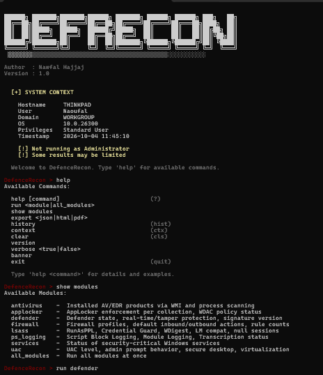

# DefenceRecon

DefenceRecon is an interactive PowerShell-based Windows security enumeration tool built for red teamers and penetration testers. It queries defence configurations, AV/EDR products, LSASS protections, logging policies, and more — all from a clean interactive shell with Tab completion, history, and structured export.

---

## Getting Started

```powershell
Set-ExecutionPolicy -Scope Process -ExecutionPolicy Bypass
.\DefenceRecon.ps1
```

Run as Administrator for full accuracy — some registry keys and service states require elevated privileges. Handle execution policy per your environment before launching.


---

## Requirements

- Windows 10 / 11 or Windows Server 2016+
- PowerShell 5.1 or later
- Administrator privileges recommended for complete results
